# Secure Tickets (Ticketing Web Application)
## Contents
* [Introduction](#Introduction)
* [Running the Application](#Running-the-Application)
  * [Docker](#Docker)
  * [Bare Metal](#Bare-Metal)
* [Key Features](#Key-Features)
  * [Register & Login](#Register--Login)
  * [Events & Buying Tickets](#Events--Buying-Tickets)
  * [Account](#Account)
  * [Ticket QR Code](#Ticket-QR-Code)
  * [Ticket Scanning](#Ticket-Scanning)
  * [Ticket Verification](#Ticket-Verification)

## Introduction
Secure Tickets, created as part of a Stage 4/Masters team project, is a web application for a secure ticketing system for in-person events. This application allows users to buy tickets for events and present their ticket as a QR Code. Management users, within this system, are able to scan tickets and verify their authenticity. The main security of this application employs a digital signature scheme to maintain ticket integrity of the QR code and encryption to maintain ticket confidentiality through a secure connection.


This application uses the following web stack:
* Flask
* React
* MySQL
* Nginx

## Running the Application
### Docker
#### Requirements
You will need to install:
* Docker

**Note:** If you wish to run the application for development without Docker, go to the [Bare Metal](#Bare-Metal) section.
#### Creating the Environment File
In the root folder containing `docker-compose.yml`, create the file `.env` with the following contents:
```.env
# Flask
SECRET_KEY=<YOUR_SECURE_SECRET_KEY>
JWT_SECRET_KEY=<YOUR_SECURE_JWT_KEY>

# MySQL
MYSQL_HOST=db
MYSQL_DATABASE=<DATABASE_NAME>
MYSQL_USER=<USER_NAME>
MYSQL_PASSWORD=<PASSWORD>

# Host Address
HOST=<YOUR_IP_ADDRESS>
```

#### Self-Signed Certificate
To generate the self-signed certificate and key files for Nginx, create the directory `nginx/certs`. Then change into this directory in terminal, then run the command:
```cmd
openssl req -x509 -newkey rsa:4096 -nodes -out cert.pem -keyout key.pem -days 365
```

#### Running Docker
To start up the application, in the root directory, run the command:
```cmd
docker-compose up
```
**Note:** It may take a long time to build for the first time.

To stop the application, run the command:
```cmd
docker-compose stop
```
#### Populating the Database
To populate the database with some sample data, run the command:
```cmd
docker exec secure-tickets-flask-1 python sample_data.py
```
This command will create the following users that can be used in the application:
* **Test user:**
  * Email: `test@test.com`
  * Password: `test1234`
* **Management user:**
  * Email: `admin@test.com`
  * Password: `test1234`

Events are also created and have a start time based on when the sample data script is ran. 
#### Accessing the Application
In your web browser, navigate to:
```
https://<YOUR_IP_ADDRESS>
```
As a self-signed certificate is used, you will have trust the certificate in your browser to access the site.
### Bare Metal
To run this application bare metal, you will need to run Flask and React separately.

For more details, read the individual README files:
* [Flask](flask-server/README.md)
* [React](frontend/README.md)

## Key Features
### Register & Login
Users are able to register for an account or login to an already existing account. Registered users will automatically be assigned the role 'user' which means that they are a customer. Management users can only be created from the server.

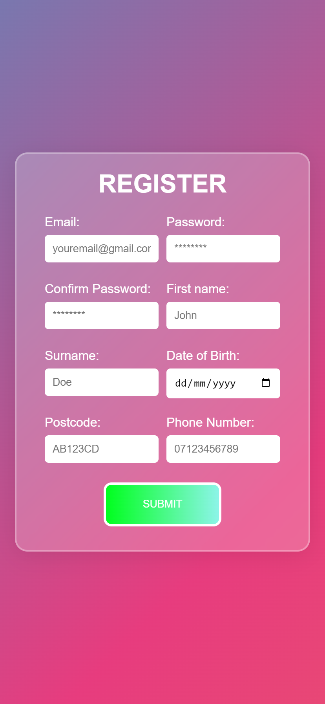 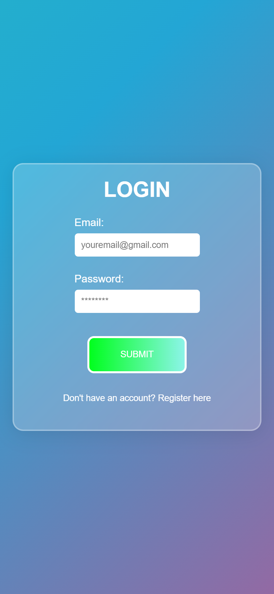

When the user successfully logs in, the server will determine which role they have (either user or management) and the client-side application will then generate the pages of the application based on that role.

### Events & Buying Tickets
On the user home page, users can view and search for events. The user can select to 'view event', and they will be presented with details of the event and the option to buy tickets. When the user is buying tickets, a modal will popup which allows the user to select the ticket quantity and ticket type (either standard, VIP or deluxe).

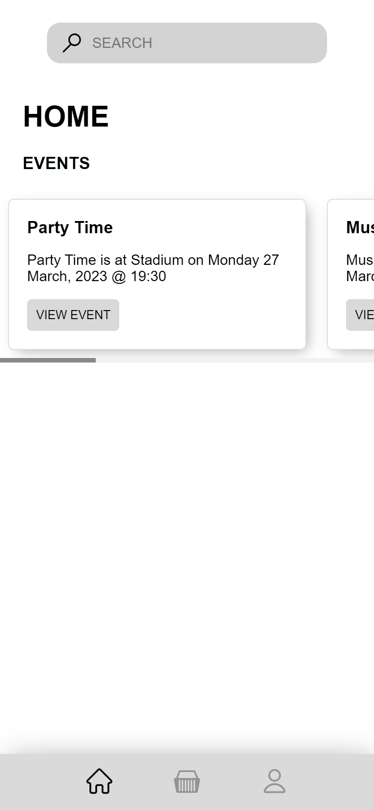 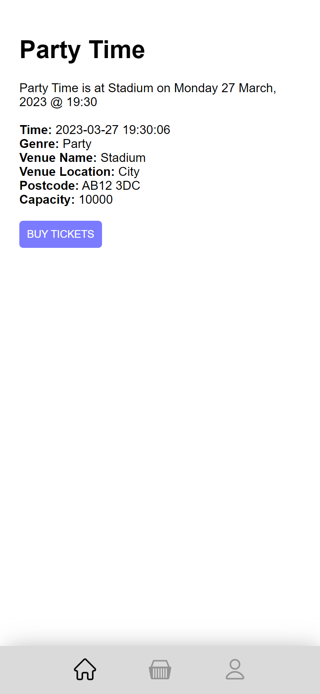 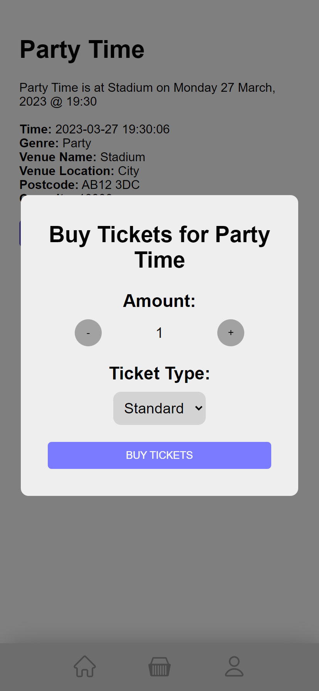

### Account
On the account page, the user is able to view their account information and view purchased tickets.

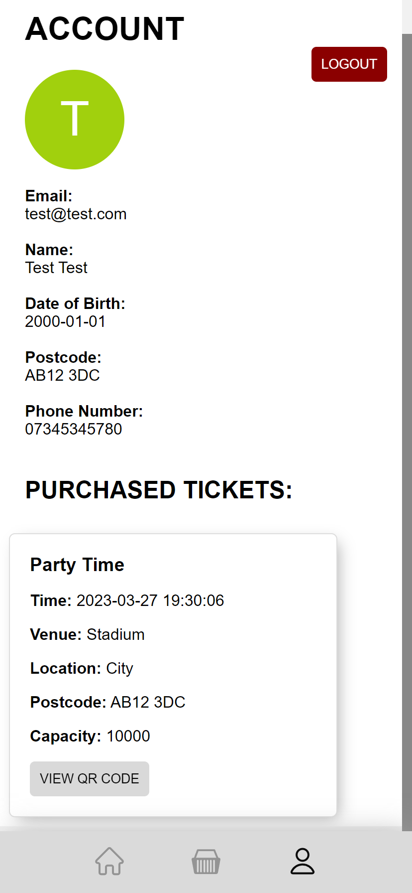

### Ticket QR Code
When the user presses to view the QR code on a ticket, the application will make a request to the server to generate the data for the QR code. When the server verifies the request and sends the QR data to the user, the QR code image will be generated on the client-side and be presented in a modal.

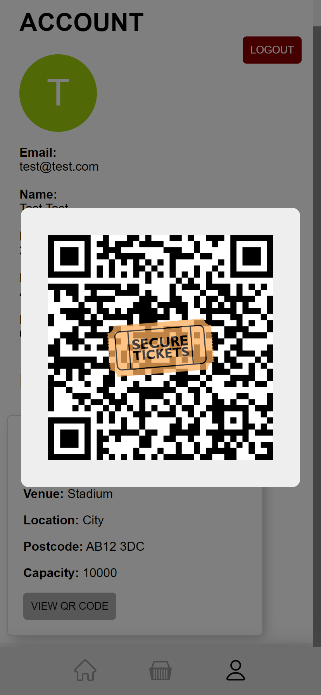

The client-side security features of the QR code to ensure the QR code is not screenshotted or recorded include:
* An animated logo located in the centre of the QR code
* Tapping the QR code generates fireworks

The server-side security features of the ticket include:
* The QR data includes a signature of the ticket details to prevent the modification of a ticket.
* The user is only able to have one valid session with the server and any previous session is invalidated to prevent multiple devices generating QR codes for the same ticket.
* The current session is hashed with a fresh salt and placed in the QR data to allow the server to verify that ticket generated was by the current session.
* Tickets are marked as used in the database when a valid ticket has been scanned to prevent a ticket from being used more than once.

### Ticket Scanning
On the management home page, while logged in as a user with the management role, the user has the option to select an event to scan tickets for. When an event is selected, the camera will open to allow ticket QR codes to be scanned.

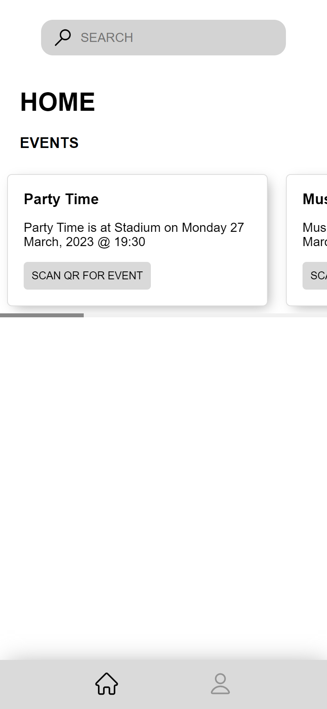 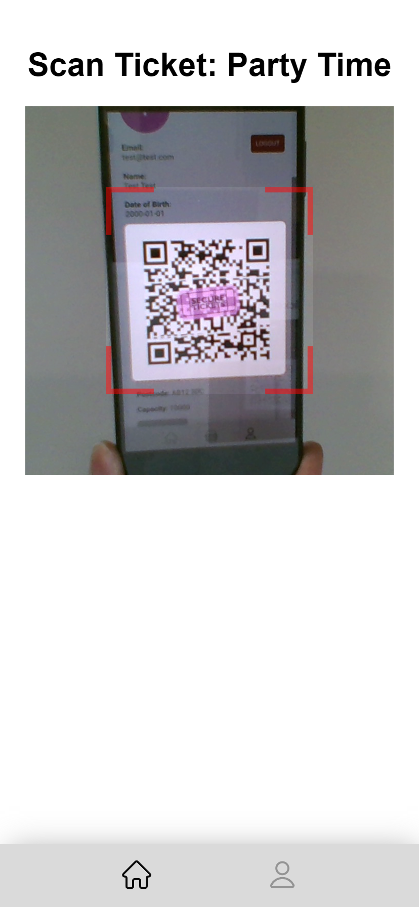

### Ticket Verification
Once a ticket is scanned by a management user, the event ID (of the current event) and QR data is sent to the server. The server will verify the ticket is valid for the current event and will check the integrity of the ticket using the signature.

When a valid ticket is scanned, the server will return a success message with the ticket type that the user has. This information is then displayed to the management user.

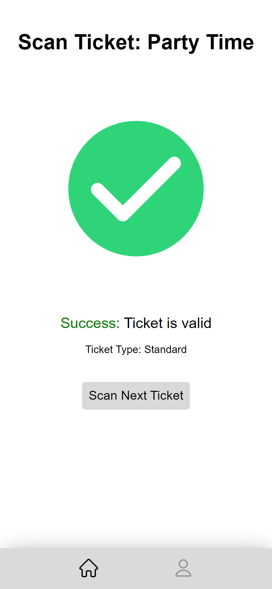

When an invalid ticket is scanned (e.g. non-ticket QR code, modified ticket, previously scanned ticket, expired ticket from previous user session, ticket for another event, ...), the server will return a failure message and this will be displayed to the management user.

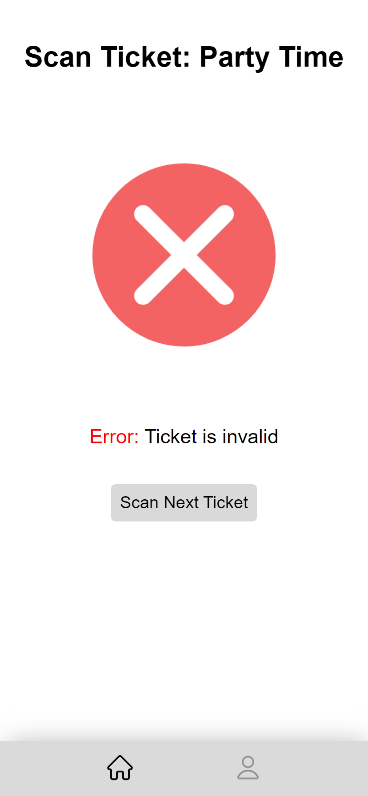 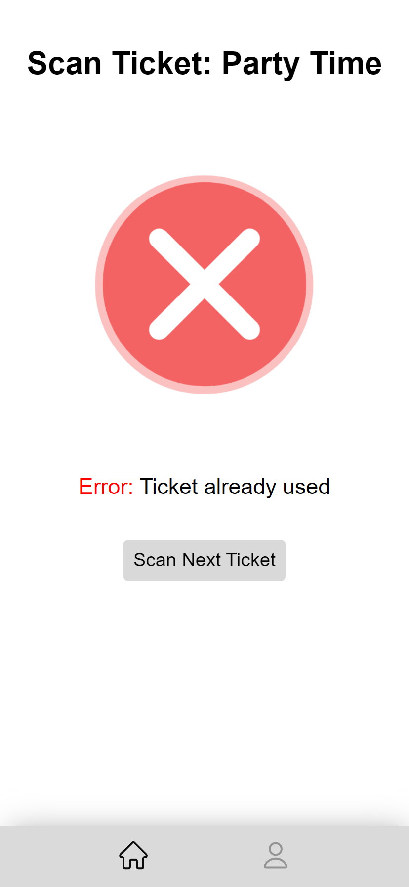 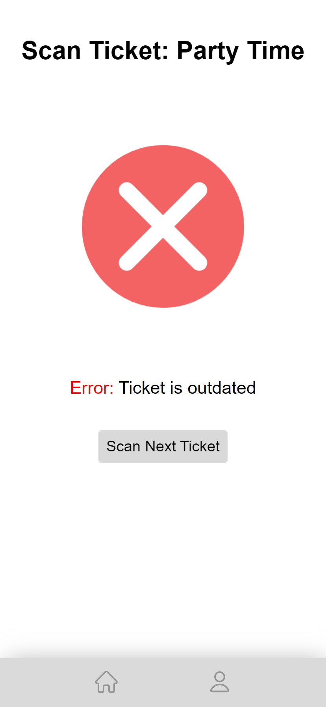 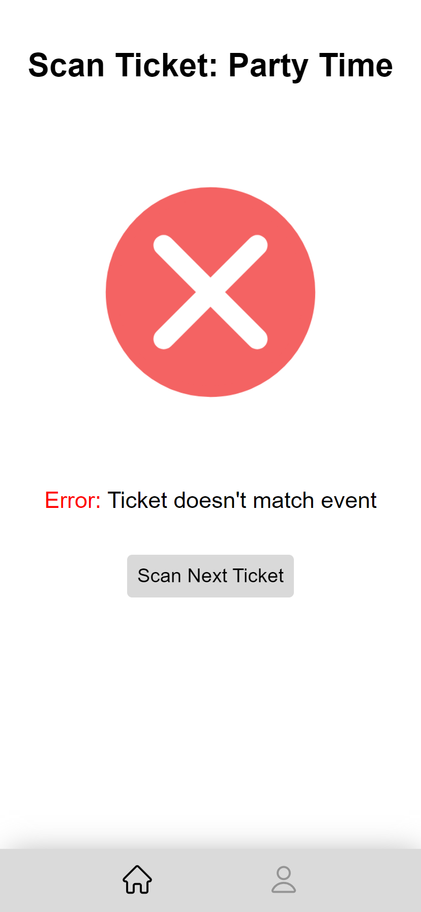

